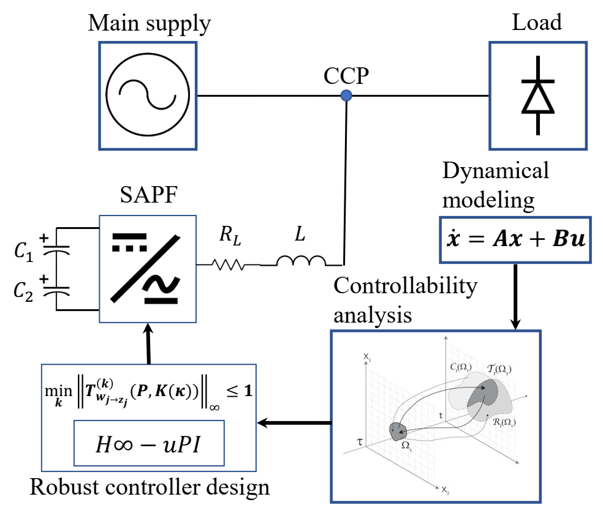
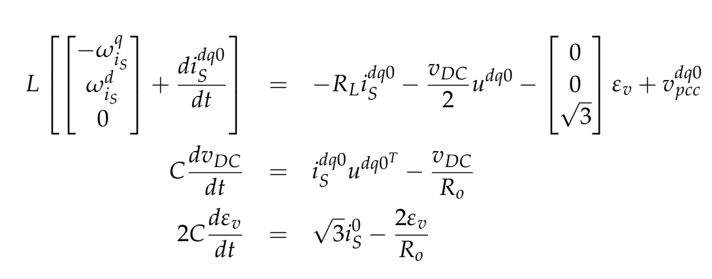
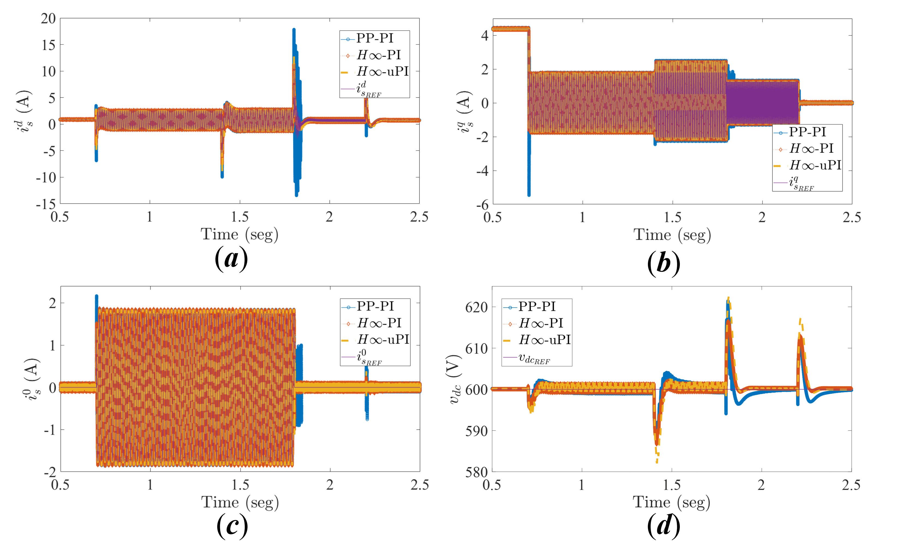

# TLSC SPAF - Nonlinear Model - Closed-loop operation

This repository presents the implementation of the PI controllers to reproduce the results presented in the paper **Three-leg Split-Capacitor Shunt Active Power Filter presented by Urrea-Quintero et al. 2020 (Energies)**

---

  

---

The TLSC SAPF model, after **dq0** transformation, is given by: 

  

<!---

--->

Three inner PI controllers are implemented to regulate SAPF active, in quadrature, and zero current components. An outer PI controller is implemented to indirectly regulate DC-link voltage through the direct current componen.  

---

  

---
